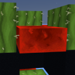
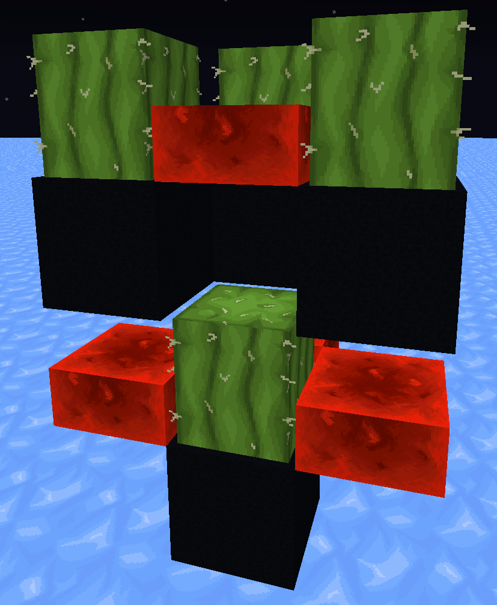

<h1 align="center">String to Redstone Slab</h1>

A utility Minecraft resource pack that turns strings into 3D Redstone Slabs and colors sand pitch black for high-visibility cactus farm construction.

> [!TIP]
> **Don't want black sand?** If you prefer normal sand, just delete `sand.png` and `red_sand.png` from `assets/minecraft/textures/block/`.
